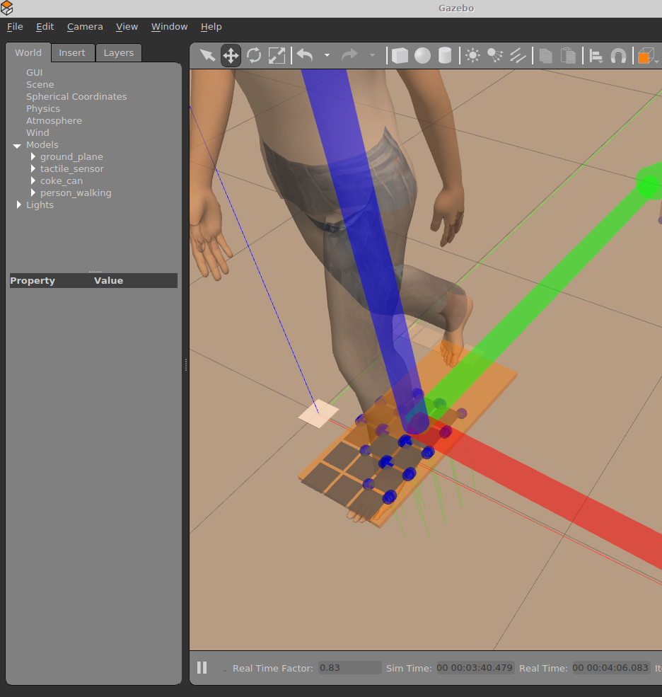
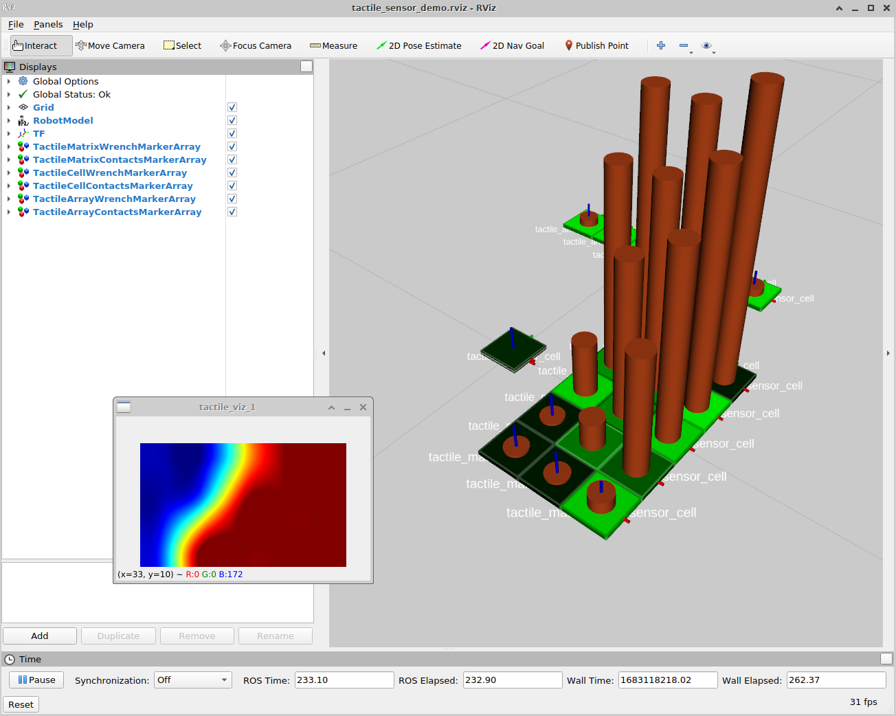

## tams_tactile_sensor_array_gazebo

This package provides Gazebo simulation models (URDF models) and
visualization utilities for membrane-type tactile sensors.
In particular, this package complements our low-cost flexible tactile
sensors described in [3].

The corresponding software and hardware repositories are available at

- http://github.com/TAMS-Group/tams_tactile_sensor_array
- http://github.com/TAMS-Group/tams_tactile_sensor_hardware

The <a href="urdf/tactile_sensor.xacro">URDF model</a> 
supports single sensor cells as well as 1-D (linear) and 2-D (matrix) arrays. 
The cell dimensions can be configured freely,
but all cells are assumed to have the same size and orientation.
Curved sensors are not supported directly, but can be approximated by
polygonal alignment of 1xn and 1x1 individual sensors.






## Tactile sensor modeling approach

Each sensor cell is modeled as a small rectangle box that is mounted
via a flexible joint to its parent component (e.g. a robot finger or 
the floor). The joint can be controlled if needed to guarantee a 
specific geometric configuration, but can also be left floating in
the simulation. 

To measure the incoming force on the sensor cell, two different mechanisms 
are configured.
First, a force/torque sensor is connected to each sensor cell joint and
configured as a ROS plugin that publishes <tt>geometry_msgs/WrenchStamped</tt>
messages. That is, full 3-DOF force direction as well as 3-DOF effective
torque is available from the simulator (while the real velostat foil sensors
only provide normal force).
Second, a contact/bumper sensor is connected to the sensor cell box,
and again a ROS plugin is configured for this. The effective force 
is then calculated as the sum of the contribution of individual contacts
listed in the <tt>gazebo_msgs/ContactsState</tt> message.
Just uncomment the corresponding parts of the URDF model if you don't
need one of the plugins, and keep the other one going.

## Nodes

Currently, only two simple ROS nodes are provided in this package.
Both are implemented as Python scripts located in the <tt>nodes/<tt>
subdirectory:

- <tt>tactile_sensor_visualizer</tt> subscribes to the Wrench
  and/or ContactsState messages, and first applies exponential averaging 
  (smoothing) to the incoming data. It then creates 
  <tt>MarkerArray</tt> messages for visualization in rviz.

- <tt>tactile_sensor_proxy</tt> takes the same input messages,
  but creates a <tt>TactileSensorArrayData</tt> message that
  matches the output data from our real (Arduino+velostat foil)
  hardware sensors. It can therefore be used to test complete
  manipulation pipelines in simulation before application on the
  real system.


### Installation

Simply clone the repository into your workspace and build your workspace.
Make sure that all required dependencies, and in particular <tt>gazebo</tt> 
and <tt>tams_tactile_sensor_array</tt>, are installed and functional.

For a first test, run
```
roslaunch tams_tactile_sensor_array_gazebo tactile_sensor_gazebo.launch 
```
This uploads a URDF file with three sensors onto the parameter server,
then starts the Gazebo simulator and spawns the robot (=sensors) model.
It also starts <tt>rviz</tt> for visualization of sensor data.

The demo model covers all three supported sensor types:
- a single cell (1x1) tactile sensor,
- a linear array sensor (1x6 cells),
- a matrix array sensor (5x3 cells).

Once the simulation is running, add additional objects (e.g. the Coke can,
some boxes, or standing human) into your simulation and bring them onto
the sensor(s).  Don't hesistate to send email if you find a particularly 
interesting configuration.

To change node parameters at run-time, publish key+value strings to
the various command topics:

```
rostopic pub -1 /tactile_cell_visualizer/command std_msgs/String "data: 'help'" 
rostopic pub -1 /tactile_array_visualizer/command std_msgs/String "data: 'verbose 10'"
rostopic pub -1 /tactile_sensor_visualizer/command std_msgs/String "data: 'alpha 0.5'"
rostopic pub -1 /tactile_matrix1_proxy/command std_msgs/String "data: 'fscale -7.7'"
...
```

## References:


[1] http://github.com/TAMS-Group/tams_tactile_sensor_array
[2] http://github.com/TAMS-Group/tams_tactile_sensor_hardware
[3] Niklas Fiedler, Philipp Ruppel, Yannick Jonetzko, Norman Hendrich, Jianwei Zhang, 
     Low-Cost Fabrication of Flexible Tactile Sensor Arrays, HardwareX, 2022. 
     doi: 10.1016/j.ohx.2022.e00372
